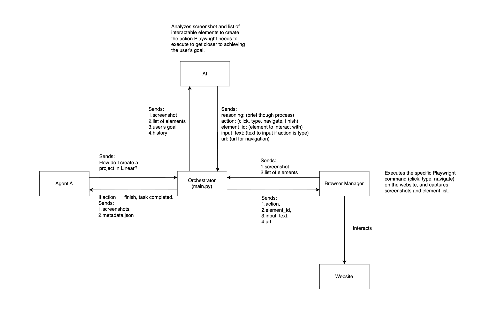

## AGENT B - UI STATE CAPTURE SYSTEM

Agent B receives natural-language tasks from Agent A and generates step-by-step UI state screenshots showing how to complete the requested workflow inside a live web application.

It is designed to navigate real web apps in real time, using:

- Playwright — to perform clicks, typing, navigation, and capture screenshots.
- Gemini (Vision + Text) — to interpret the UI, reason about the next action, and create an execution plan.
- A multimodal feedback loop — combining vision with a simplified interactable-element list.

This allows Agent B to:
- Navigate dynamic, non-URL states (modals, popovers, dropdowns, virtualized menus).
- Capture precise UI screenshots for the vision AI model or documentation systems.
- Generalize across any web app without custom scrapers, or app-specific hardcoding.

### High-Level Architecture


### Project Structure
- main.py: Orchestrates the control loop and task execution. 
- browser_manager.py: Handles Playwright execution, screenshot capture, and DOM interaction.
- ai_handler.py: Uses Gemini for multimodal reasoning + next-action prediction.  
- dom_scripts.py: Injected scripts that parse the accessibility tree into a simplified format.
- dataset/: The output directory containing screenshots and structured metadata logs.

### Features
1. DOM Filtering: Converts raw HTML into a simple list of interactable elements which reduces noise and is easy for the LLM to understand.
2. Blind Typing: Heavily interactive SPAs (Google Sheets or Notion) often virtualize focus states. A standard Playwright click can sometimes de-focus a field if it hits a parent container. The system implements a Visual Focus Check: if the Vision model detects an active cursor or focus ring, it bypasses the physical click and types directly to the active window context.

### Installation and Setup
Prerequisites: Python 3.9+

1. Clone the repository:
```bash
git clone https://github.com/Darsh70/agent-b-ui-state-capture
cd agent-b-ui-state-capture
```

2. Create a virtual environment
```bash
# Create a virtual environment
python -m venv venv

# Activate the virtual environment
venv\Scripts\activate # On Windows

source venv/bin/activate # On macOS/Linux
```
3. Install dependencies:
```bash
pip install -r requirements.txt
```

4. Install Playwright
```bash
playwright install
```

5. Configure environment
- Create a .env file in the root directory and add:
```bash
GOOGLE_API_KEY=gemini_api_key
```

### Usage
You can configure the agent to run any task by modifying the run_task parameters in main.py.
```bash
# main.py
if __name__ == "__main__":
    run_task(
        task_name="linear_new_project",
        goal="How do I create a new project named Agent B in Linear",
        start_url="https://linear.app/"
    )
```
Run the agent:
```bash
python main.py # On Windows

python3 main.py # On macOS
```

### Output
The system generates a structured dataset for every run, organized by task.

- screenshots/: Screenshots capturing every UI state (page, modals, dropdowns, typing).
- metadata.json: A JSON log mapping every screenshot to the AI's reasoning and the action taken

### Example Metadata Entry:

```bash
{
    "reasoning": "The 'New project' modal is open, and the input field for 'Project name' is visible. I need to type 'Agent B' into this field, which is likely already focused after opening the modal. Then I will click 'Create project'.",
    "action": "type",
    "element_id": null,
    "input_text": "Agent B",
    "url": null,
    "screenshot_file": "step_03.png",
    "step_number": 3
  },
  ```

  ### Demos
  The ```dataset/``` folder includes workflows for:

Linear: 
1. How do I create a project?
2. How do I create an issue and assign it to a person?
3. How do I move an issue to a different cycle?
4. How do I add multiple filterable elements to an issue?
5. How do I change the theme to dark mode?

Notion:
1. How do I filter a database by "Done"?
2. How do I duplicate and move a page?
3. How do I add a property to a database?
4. How do I change the database to Board view?

